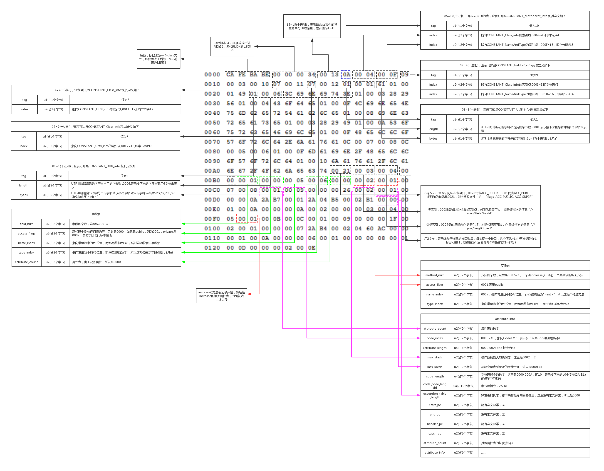

# Class类结构分析

# 源码

```java
package com.roboslyq.jdk.lang;

public class ObjectTest {
    public static void main(String[] args) {
        System.out.println("hello world");
    }
}

```

# Class 结构

- JDK编译版本(java8)
- 使用Editplus，UEdit等编辑器打开，可得如下16进行编码：

```
cafe babe 0000 0034 0022 0a00 0600 1409
0015 0016 0800 170a 0018 0019 0700 1a07
001b 0100 063c 696e 6974 3e01 0003 2829
5601 0004 436f 6465 0100 0f4c 696e 654e
756d 6265 7254 6162 6c65 0100 124c 6f63
616c 5661 7269 6162 6c65 5461 626c 6501
0004 7468 6973 0100 224c 636f 6d2f 726f
626f 736c 7971 2f6a 646b 2f6c 616e 672f
4f62 6a65 6374 5465 7374 3b01 0004 6d61
696e 0100 1628 5b4c 6a61 7661 2f6c 616e
672f 5374 7269 6e67 3b29 5601 0004 6172
6773 0100 135b 4c6a 6176 612f 6c61 6e67
2f53 7472 696e 673b 0100 0a53 6f75 7263
6546 696c 6501 000f 4f62 6a65 6374 5465
7374 2e6a 6176 610c 0007 0008 0700 1c0c
001d 001e 0100 0b68 656c 6c6f 2077 6f72
6c64 0700 1f0c 0020 0021 0100 2063 6f6d
2f72 6f62 6f73 6c79 712f 6a64 6b2f 6c61
6e67 2f4f 626a 6563 7454 6573 7401 0010
6a61 7661 2f6c 616e 672f 4f62 6a65 6374
0100 106a 6176 612f 6c61 6e67 2f53 7973
7465 6d01 0003 6f75 7401 0015 4c6a 6176
612f 696f 2f50 7269 6e74 5374 7265 616d
3b01 0013 6a61 7661 2f69 6f2f 5072 696e
7453 7472 6561 6d01 0007 7072 696e 746c
6e01 0015 284c 6a61 7661 2f6c 616e 672f
5374 7269 6e67 3b29 5600 2100 0500 0600
0000 0000 0200 0100 0700 0800 0100 0900
0000 2f00 0100 0100 0000 052a b700 01b1
0000 0002 000a 0000 0006 0001 0000 0003
000b 0000 000c 0001 0000 0005 000c 000d
0000 0009 000e 000f 0001 0009 0000 0037
0002 0001 0000 0009 b200 0212 03b6 0004
b100 0000 0200 0a00 0000 0a00 0200 0000
0500 0800 0600 0b00 0000 0c00 0100 0000
0900 1000 1100 0000 0100 1200 0000 0200
13
```

> 约定读数规则：ch[x,y,z]表示第x行的第y个字符到第z个字符，不包含空格并且从1开始。例如ch[1,1,8]=cafebabe

## 魔数

**ch[1,1,8] = cafe babe**

这个没啥好说的，java特有的标识。

## 版本号

**ch[1,9,12] = 00 00** 次版本号

**ch[1,13,16] = 00 34** 主版本号

**Class版本号与JDK对应关系**

> | **JDK版本号** | **Class版本号** | **16进制**  |
> | ------------- | --------------- | ----------- |
> | 1.1           | 45.0            | 00 00 00 2D |
> | 1.2           | 46.0            | 00 00 00 2E |
> | 1.3           | 47.0            | 00 00 00 2F |
> | 1.4           | 48.0            | 00 00 00 30 |
> | 1.5           | 49.0            | 00 00 00 31 |
> | 1.6           | 50.0            | 00 00 00 32 |
> | 1.7           | 51.0            | 00 00 00 33 |
> | 1.8           | 52.0            | 00 00 00 34 |

## 常量池大小

**ch[1,17,20] = 0022** 常量池大小

>  22 = 2*16 + 2 = 34 (十进制)，表示该class文件的常量池中有(34-1)=33 项常量，索引值为1~32


