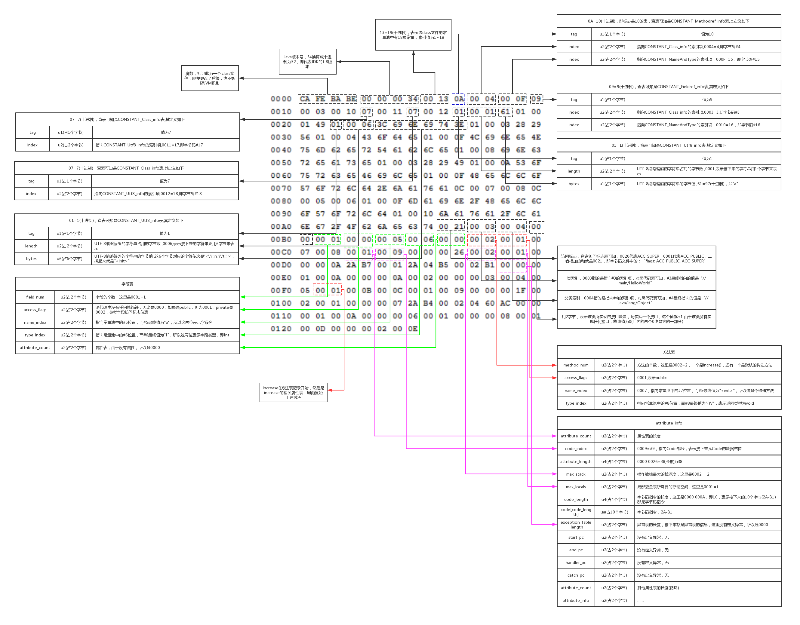

# Class类结构分析

# 1. 源码

再进行class类文件结构分析，我们先生成相应的class文件。本文使用的java源码如下：

```java
package com.roboslyq.jdk.lang;

public class ObjectTest {
    public static void main(String[] args) {
        System.out.println("hello world");
    }
}

```

# Class 结构

## Class十六进制

- JDK编译版本(java8)
- 使用Editplus，UEdit等编辑器打开，可得如下16进行编码：

```
CA FE BA BE 00 00 00 34  00 22 0A 00 06 00 14 09
00 15 00 16 08 00 17 0A  00 18 00 19 07 00 1A 07
00 1B 01 00 06 3C 69 6E  69 74 3E 01 00 03 28 29
56 01 00 04 43 6F 64 65  01 00 0F 4C 69 6E 65 4E
75 6D 62 65 72 54 61 62  6C 65 01 00 12 4C 6F 63
61 6C 56 61 72 69 61 62  6C 65 54 61 62 6C 65 01
00 04 74 68 69 73 01 00  22 4C 63 6F 6D 2F 72 6F
62 6F 73 6C 79 71 2F 6A  64 6B 2F 6C 61 6E 67 2F
4F 62 6A 65 63 74 54 65  73 74 3B 01 00 04 6D 61
69 6E 01 00 16 28 5B 4C  6A 61 76 61 2F 6C 61 6E
67 2F 53 74 72 69 6E 67  3B 29 56 01 00 04 61 72
67 73 01 00 13 5B 4C 6A  61 76 61 2F 6C 61 6E 67
2F 53 74 72 69 6E 67 3B  01 00 0A 53 6F 75 72 63
65 46 69 6C 65 01 00 0F  4F 62 6A 65 63 74 54 65
73 74 2E 6A 61 76 61 0C  00 07 00 08 07 00 1C 0C
00 1D 00 1E 01 00 0B 68  65 6C 6C 6F 20 77 6F 72
6C 64 07 00 1F 0C 00 20  00 21 01 00 20 63 6F 6D
2F 72 6F 62 6F 73 6C 79  71 2F 6A 64 6B 2F 6C 61
6E 67 2F 4F 62 6A 65 63  74 54 65 73 74 01 00 10
6A 61 76 61 2F 6C 61 6E  67 2F 4F 62 6A 65 63 74
01 00 10 6A 61 76 61 2F  6C 61 6E 67 2F 53 79 73
74 65 6D 01 00 03 6F 75  74 01 00 15 4C 6A 61 76
61 2F 69 6F 2F 50 72 69  6E 74 53 74 72 65 61 6D
3B 01 00 13 6A 61 76 61  2F 69 6F 2F 50 72 69 6E
74 53 74 72 65 61 6D 01  00 07 70 72 69 6E 74 6C
6E 01 00 15 28 4C 6A 61  76 61 2F 6C 61 6E 67 2F
53 74 72 69 6E 67 3B 29  56 00 21 00 05 00 06 00
00 00 00 00 02 00 01 00  07 00 08 00 01 00 09 00
00 00 2F 00 01 00 01 00  00 00 05 2A B7 00 01 B1
00 00 00 02 00 0A 00 00  00 06 00 01 00 00 00 03
00 0B 00 00 00 0C 00 01  00 00 00 05 00 0C 00 0D
00 00 00 09 00 0E 00 0F  00 01 00 09 00 00 00 37
00 02 00 01 00 00 00 09  B2 00 02 12 03 B6 00 04
B1 00 00 00 02 00 0A 00  00 00 0A 00 02 00 00 00
05 00 08 00 06 00 0B 00  00 00 0C 00 01 00 00 00
09 00 10 00 11 00 00 00  01 00 12 00 00 00 02 00
13 
```


> 1、约定读数规则：ch[x,y,z]表示第x行的第y个字符到第z个字符，不包含空格并且从1开始。例如ch[1,1,8]=cafebabe
>
> 2、无符号数属于基本类型，分别以u1,u2,u4,u8表示1个字节，2个字节，4个字节和8个字节。
>
> 3、以上编辑展示中，一个字符是4比特(bit),两个字符是1个字节(Bytes)
>
> 4、XXX_info表示“表”这种数据类型，用来描述有层次 关系 的复合结构的数据。

## 类文件结构定义

参考`《Java 虚拟机规范》`给出的类文件定义格式如下：

```
ClassFile {
    u4 magic;	
    u2 minor_version;
    u2 major_version;
    u2 constant_pool_count;
    cp_info constant_pool[constant_pool_count-1];
    u2 access_flags;
    u2 this_class;
    u2 super_class;
    u2 interfaces_count;
    u2 interfaces[interfaces_count];
    u2 fields_count;
    field_info fields[fields_count];
    u2 methods_count;
    method_info methods[methods_count];
    u2 attributes_count;
    attribute_info attributes[attributes_count];
}
```

| 类型           | 名称                | **描述**                                                     | 数量                  |
| -------------- | ------------------- | ------------------------------------------------------------ | --------------------- |
| u4             | magic               | 魔数，*识别**Class**文件格式，具体值为**0xCAFEBABE***        |                       |
| u2             | minor_version       | 次版本号                                                     |                       |
| u2             | major_version       | 主版本号                                                     |                       |
| u2             | constant_pool_count | 常量池大小                                                   |                       |
| cp_info        | constant_pool       | 一张表，表大小为constant_pool_count-1                        | constant_pool_count-1 |
| u2             | access_flags        | **Class**的声明中使用的修饰符掩码。比如public,private等      |                       |
| u2             | this_class          | 类索引，保存当前类名或接口名                                 |                       |
| u2             | super_class         | 父类索引，保存当前类父类名                                   |                       |
| u2             | interfaces_count    | 实现接口数量                                                 |                       |
| u2             | interfaces          | *常数表索引，各超接口名称，*                                 |                       |
| u2             | fields_count        | 字段集合，描述接口或者类中声明的变量。包含字段作用域，实例变量还是类变量，可变性(final),并发性(volatile),可否被序列化(transient)，字段类型(基本类型，对象，数组)、字段名称 |                       |
| u2             | methods_count       | 方法数量                                                     |                       |
| method_info    | method_info         | 方法表，其表结构包含了访问标识（access_flags），名称索引，描述符索引，**属性表集合** | methods_count         |
| u2             | attributes_count    | 属性表数据大小                                               |                       |
| attribute_info | attribute_info      | 属性表集合                                                   | attributes_count      |

每一个Class类文件定义最后会有一个c语言文件与之对应。Class文件格式ClassFile结构体的C语言描述如下：

```c
struct ClassFile
{

    u4 magic;                        //识别Class文件格式，具体值为0xCAFEBABE，

    u2 minor_version;            	// Class文件格式副版本号，

    u2 major_version;               // Class文件格式主版本号，

    u2 constant_pool_count;         //  常数表项个数，

    cp_info **constant_pool;        // 常数表，又称变长符号表，

    u2 access_flags;               //Class的声明中使用的修饰符掩码，

    u2 this_class;                   //常数表索引，索引内保存类名或接口名，

    u2 super_class;                //常数表索引，索引内保存父类名，

    u2 interfaces_count;        //超接口个数，

    u2 *interfaces;                 //常数表索引，各超接口名称，

    u2 fields_count;       //类的域个数，

    field_info **fields;          //域数据，包括属性名称索引，域修饰符掩码等，

    u2 methods_count;          //方法个数，

    method_info **methods;//方法数据，包括方法名称索引，方法修饰符掩码等，

    u2 attributes_count;        //类附加属性个数，

    attribute_info **attributes; //类附加属性数据，包括源文件名等。

};
```


## 魔数

**ch[1,1,8] = u4 = cafe babe**

这个没啥好说的，第一行第1位到第8位，共4个字节长度(u4)为`CAFE BABE`,java特有的标识。

## 版本号

**ch[1,9,12] = u2 = 00 00** 次版本号

**ch[1,13,16] = u2 = 00 34** 主版本号

**Class版本号与JDK对应关系**

> | **JDK版本号** | **Class版本号** | **16进制**  |
> | ------------- | --------------- | ----------- |
> | 1.1           | 45.0            | 00 00 00 2D |
> | 1.2           | 46.0            | 00 00 00 2E |
> | 1.3           | 47.0            | 00 00 00 2F |
> | 1.4           | 48.0            | 00 00 00 30 |
> | 1.5           | 49.0            | 00 00 00 31 |
> | 1.6           | 50.0            | 00 00 00 32 |
> | 1.7           | 51.0            | 00 00 00 33 |
> | 1.8           | 52.0            | 00 00 00 34 |

## 常量池大小

**ch[1,17,20] = 0022** 常量池大小。

>  22 = 2*16 + 2 = 34 (十进制)，表示该class文件的常量池中有(34-1)=33 项常量，索引值为1~32。Java设计者将第0位的索引空出来，用来表达“不引用任何一个常量池项目”的这种特殊场景。

常量池可以理解为Class文件中的资源仓库，主要用来存放两大类常量：字面量(Literal)和符号引用(Symbolic Refrences)。字符量接近于Java语言层面中常量的概念。比如文本字符串，声明为final的常量值等。而符号引用则属于编译原理方面的概念，包括以下三类常量：

- 类和接口的全限定名
- 字段的名称和描述符
- 方法的名称和描述符

> 注：虚拟机加载Class类文件的时候进行动态链接。动态链接即Class文件中不保存各个方法，字段在内存中布局信息，因此这些字段无法直接被JVM使用。需要经过运行期转换得到真正的内存地址入口信息。当JVM运行时，先从常量池获得对应的符号引用，再在类创建时或者运行时解析、翻译到具体的内存地址之中。
>
> 常量池中每一项常量都是一个表。


**常量池项目类型**

```
#define CONSTANT_Class              	7       			类或接口的符号引用

#define CONSTANT_Fieldref           	9					字段的符号引用

#define CONSTANT_Methodref          	10					类中方法的符号引用

#define CONSTANT_InterfaceMethodref     11						接口中的方法符号引用

#define CONSTANT_String                  8						字符串类型字面量

#define CONSTANT_Integer                 3						整形字面旦

#define CONSTANT_Float                   4						浮点型字面量

#define CONSTANT_Long                    5						长整形字面量

#define CONSTANT_Double                  6						双精度浮点型字面量

#define CONSTANT_NameAndType             12						字段或方法的部分符号引用

#define CONSTANT_Utf8                     1						UTF-8编码的字符串

--JDK1.7之后为了更好的支持动态言，又新加3种常量
CONSTANT_MethodHandle_info			      15				表示方法句柄
CONSTANT_MethodType_info				  16				标识方法类型
CONSTANT_InvokeDynamic_info				  18				表示一个动态的方法调用点
```

> 注：上面14种常量类型各自有自己的结构。




# 参考资料

[Java Class文件格式、常量池项目的类型、表的结构](https://blog.csdn.net/m0_37701628/article/details/86684589)

[解决Java Class文件格式](https://blog.csdn.net/tyrone1979/article/details/964560)