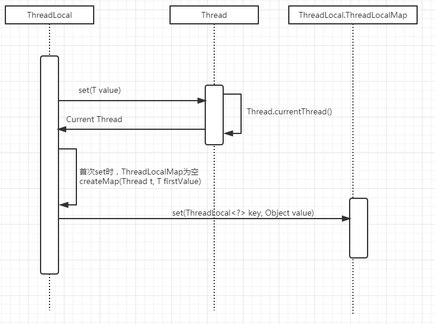
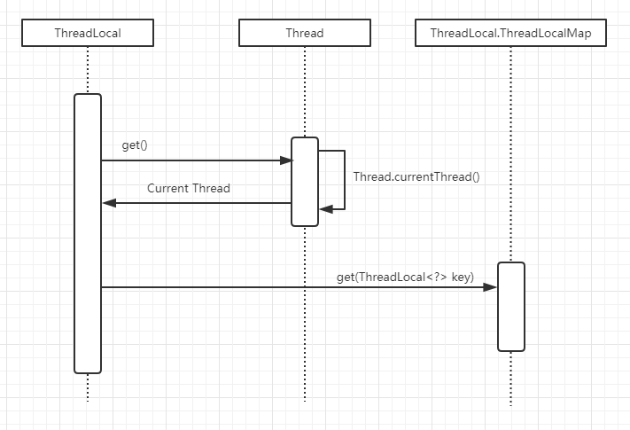
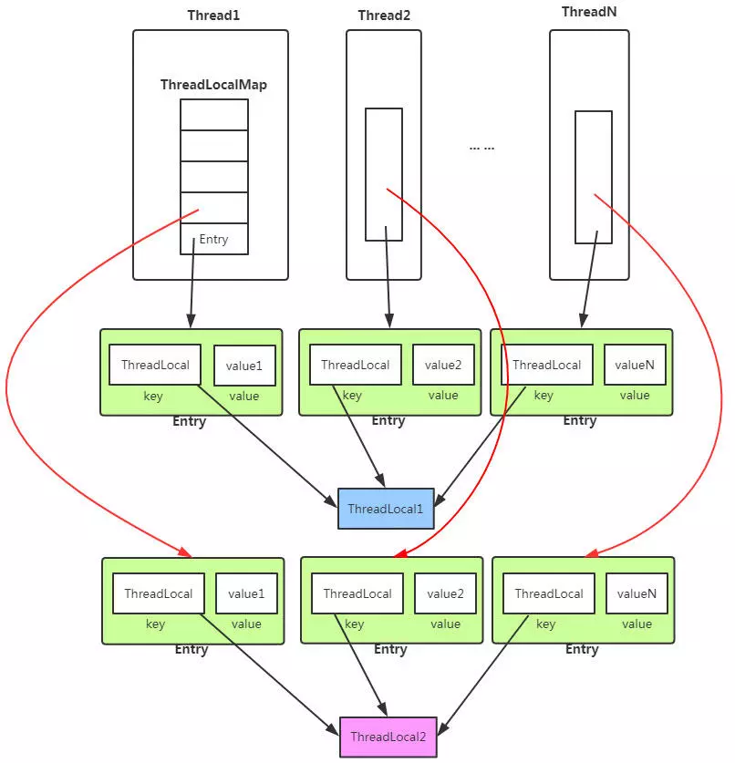

* content
{:toc}
# 1.ThreadLocal简介

`ThreadLocal`是从JDK1.2就开始有的一个类。主要功能有两点：

- 保证线程间共享变量安全。
- 在同一线程中，任何地方的方法调用可以方便的获取当前线程保存在`ThreadLocal`中的值。而不用通过函数传参。

# 2. 代码演示

```java
package com.roboslyq.jdk.lang;
public class ThreadLocalTest {
   private final static ThreadLocal<String> THREAD_LOCAL_1 = new ThreadLocal<String>();
   private final static ThreadLocal<String> THREAD_LOCAL_2 = new ThreadLocal<String>();
    public static void main(String[] args) throws InterruptedException {
        //模拟不同的线程赋值和取值
        for(int i=0;i<2;i++){
            new Thread(
                    new Runnable() {
                        public void run() {
                            ThreadLocalTest.getThreadLocal1().set("currentThead -- 								THREAD_LOCAL_1 -- " + Thread.currentThread().getId());
                            ThreadLocalTest.getThreadLocal2().set("currentThead -- 								THREAD_LOCAL_2 -- " + Thread.currentThread().getName());
                            Print print = new Print();
                            print.print();
                        }
                    }
            ).start();
        }
        //等待1秒，让线程在控制台完成打印
        Thread.sleep(1000);
    }
    public static ThreadLocal<String> getThreadLocal1() {
        return THREAD_LOCAL_1;
    }
    public static ThreadLocal<String> getThreadLocal2() {
        return THREAD_LOCAL_2;
    }
}
//单独一个类，模拟取值
class Print{
    //从ThreadLocal载体(ThreadLocalTest)中，获取对应的ThreadLocal保持的值
    public void print(){
        System.out.println(ThreadLocalTest.getThreadLocal1().get());
        System.out.println(ThreadLocalTest.getThreadLocal2().get());
    }
}
```

**打印日志**

```
currentThead -- THREAD_LOCAL_1 -- 11
currentThead -- THREAD_LOCAL_2 -- Thread-0
currentThead -- THREAD_LOCAL_1 -- 12
currentThead -- THREAD_LOCAL_2 -- Thread-1
Process finished with exit code 0
```

# 3. Set过程



# 4. get过程



# 5.数据结构




1、ThreadLocal定义为某个类(载体类)类变量，所有线程共享一个ThreadLocal（上图中的ThreadLocal1和ThreadLocal2）。

2、ThreadLocal中定义了一个内部类ThreadLocalMap,此Map没有实现Map接口，是内部自定义的Map结构。

3、线程Thread有一个类变量叫ThreadLocalMap。即每个线程有自己独享的ThreadLocalMap。而ThreadLocalMap的key为ThreadLocal对象。

简单理解原理就是：每一个线程都有自己独立的ThreadLocal.ThreadLocalMap。然后在线程中的任何地方可以通过Thread.CurrentThread获得当前线程，从而获取当前线程的ThreadLocalMap。进而通过ThreadLocalMap的Key(ThreadLocal)获得对应的值。

并且由于Thread是持有ThreadLocalMap引用，所以一个Thread可以有多个ThreadLocal。

总结：每个Thread中持有ThreadLocalMap引用。当调用`ThreadLocal.set(T value)`等价于调用`Thread.currentThread.ThreadLocalMap.set(this,T value)`。而调用`ThreadLocal.get()`方法时,等价于调用`Thread.currentThread.ThreadLocalMap.get(this)`。

# 6. 内存溢出

**TODO**


# 参考资料

[ThreadLocal-面试必问深度解析](https://www.jianshu.com/p/98b68c97df9b)