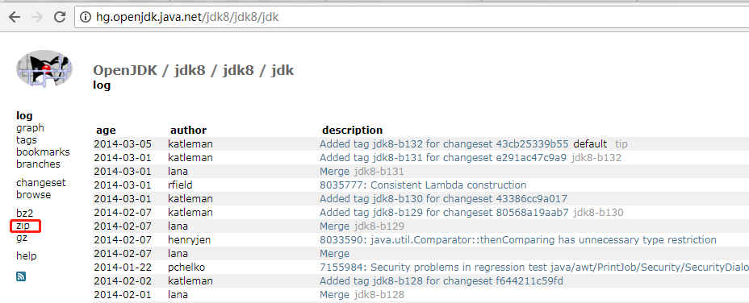

* content
{:toc}
# 一、源码下载

请移到官网下载[http://hg.openjdk.java.net/](http://hg.openjdk.java.net/jdk8/jdk8/jdk)下载。如下图所示，下载`zip`即可。



# 二、目录结构分析

##  **openJdk总目录**

```
|-openjdk
    |- common
    |— corba
    |— hotspot
    |— jaxp
    |— jaxws
    |— jdk：
    |— langtools
    |— nashorn
```

> Hotspot：全称 Java HotSpot Performance Engine，是 Java 虚拟机的一个实现，包含了服务器版和桌面应用程序版。利用 JIT 及自适应优化技术（自动查找性能热点并进行动态优化）来提高性能。

- **corba**

  不流行的多语言、分布式通讯接口。全称为 Common Object Request Broker Architecture（通用对象请求代理架构），基于对象-服务机制设计，类似于 JavaBean 和微软的 COM 技术。

- **hostspot**

  Java 虚拟机( JVM源码包)

- **jaxp**

  XML处理。全称为 Java API for XML Processing，是用于处理 XML 的 Java API，提供了解析和验证 XML 文档的能力。JAXP 提供了三种接口来处理 XML 文档：

  > DOM 接口（文档对象模型解析），其源码位于 jaxp/src/org/w3c/dom 目录。
  >
  > SAX 接口（XML 简单 API 解析），其源码位于 jaxp/src/org/xml/sax 目录。
  >
  > STAX 接口（XML 流 API），其源码位于 jaxp/src/javax/xml 目录。

  除了解析接口，JAXP 还提供了 XSLT 接口用来对 XML 文档进行数据和结构的转换。

  > 其源码位于 jaxp/src/javax/xml/transform 目录。

- **jaxws**

  一组 XML Web Services 的 Java API。

  >全称为 Java API for Web Services，JAX-WS 允许开发者选择面向 RPC（RPC-oriented）或是面向消息（Message-oriented）的方式来实现自己的 Web Services。

- **jdk**

  java开发工具包（JDK）

- **langtools**

  Java 语言工具。包含 javac、javap 等实用程序的源码。

- **nashorn**

  JVM 上的 JavaScript 运行时。基于 [JSR-223](https://jcp.org/en/jsr/detail?id=223) 协议，Java 开发者可在 Java 程序中嵌入 JavaScript 代码。

  通常我们只需要研究的是 **jdk**  和  **hotspot** 目录，即 Java 和 HotSpot 实现。这两个目录的具体内容如下所示：

## jdk 目录

jdk 目录包含了 JDK 的实现，JDK 的实现源码位于 jdk/src/share 目录，其目录结构如下图所示：

```
share/
├── back
├── bin
├── classes
├── demo
├── doc
├── instrument
├── javavm
├── lib
├── native
├── npt
├── sample
└── transport
```

- 其中 classes 目录包含的是 Java 实现，native 目录包含的是 C++ 实现。

  > 这两个目录的结构与 Java 包相对应。

- sample 和 demo 目录包含一些示例。

- back、instrument、javavm、npt、transport 等目录包含了实现 Java 的基础部分的 C++ 源码，在这里可以从最底层理解 Java。

##  hotspot（JVM）目录结构**

hotspot 目录包含了 JVM 的实现， HotSpot VM 的实现源码位于 hotspot/src 目录，其目录结构如下所示：

```
src/
├── cpu
├── os
├── os_cpu
└── share
    ├── tools
    │   ├── hsdis
    │   ├── IdealGraphVisualizer
    │   ├── LogCompilation
    │   └── ProjectCreator
    └── vm
        ├── adlc
        ├── asm
        ├── c1
        ├── ci
        ├── classfile
        ├── code
        ├── compiler
        ├── gc_implementation
        │   ├── concurrentMarkSweep
        │   ├── g1
        │   ├── parallelScavenge
        │   ├── parNew
        │   └── shared
        ├── gc_interface
        ├── interpreter
        ├── libadt
        ├── memory
        ├── oops
        ├── opto
        ├── precompiled
        ├── prims
        ├── runtime
        ├── services
        ├── shark
        ├── trace
        └── utilities
```

- cpu，CPU 相关代码（实现汇编器、模板解释器、ad 文件和部分 runtime 函数）。

- os，操作系相关代码。

- os_cpu，操作系统和 CPU 组合的相关代码。

- share，平台无关的通用代码。

  > tools，工具。
  >
  > hsdis，反汇编插件。
  >
  > IdealGraphVisualizer，将 server 编译器的中间代码可视化的工具。
  >
  > LogCompilation，将 -XX:+LogCompilation 输出的日志（hotspot.log）整理成更更具可读性格式的工具。
  >
  > ProjectCreator，生成 Visual Studio 的 project 文件的工具。
  >
  > vm，HotSpot VM 的核心代码。
  >
  > adlc，平台描述文件（cpu 或 os_cpu 目录中的 *.ad 文件）的编译器。
  >
  > asm，汇编器接口。
  >
  > c1，Client 编译器（即 C1）。
  >
  > ci，动态编译器的公共服务（从动态编译器到 VM 的接口）。
  >
  > classfile，处理类文件（包括类加载和系统符号表等）。
  >
  > code，管理动态生成的代码。
  >
  > compiler，从 VM 调用动态编译器的接口。
  >
  > gc_implementation，GC 实现代码。
  >
  >concurrentMarkSweep，Concurrent Mark Sweep GC 的实现代码。
  >
  >g1，Garbage-First GC 的实现代码。
  >
  >parallelScavenge，ParallelScavenge GC 的实现代码（Server VM 的默认 GC）。
  >
  >parNew，ParNew GC 的实现代码。
  >
  >shared，GC 的通用实现代码。
  >
  > gc_interface，GC 接口。
  >
  > interpreter，解释器，包括模板解释器（官方版使用）和 C++ 解释器（官方版未用）。
  >
  > libadt，一些抽象数据结构。
  >
  > memory，内存管理相关实现（老的分代式 GC 框架也位于此处）。
  >
  > oops，HotSpot VM 的对象系统的实现。
  >
  > opto，Server 编译器（即 C2）。
  >
  > precompiled。
  >
  > prims，HotSpot VM 的对外接口，包括部分标准库的 native 部分实现和 JVMTI 实现。
  >
  > rumtime，运行时支持库（包括线程管理、编译器调度、锁、反射等）。
  >
  > services，用于支持 JMX 之类的管理功能的接口。
  >
  > shark，基于 LLVM 的 JIT 编译器（官方版未用）。
  >
  > trace。
  >
  > utilities，一些基本工具类。


> - JDK包中的java类对应的本地方法实现路径`openjdk\jdk\src\share\native\`。例如`java.lang.Object`对象中所使用的本地方法对应的c语言实现为"`openjdk\jdk\src\share\native\java\lang\Object.c"。
> - 在windows环境下同步锁synchronize对应源码为`openjdk\hotspot\src\os_cpu\windows_x86\vm\atomic_windows_x86.inline.hpp`


# 参考资料

[jdk源码剖析一：OpenJDK-Hotspot源码包目录结构](https://www.cnblogs.com/dennyzhangdd/p/6734933.html)
[jdk源码剖析二: 对象内存布局、synchronized终极原理](https://www.cnblogs.com/dennyzhangdd/p/6734638.html)
[OpenJDK 源码目录结构](https://www.cnblogs.com/reghao/p/8419444.html)