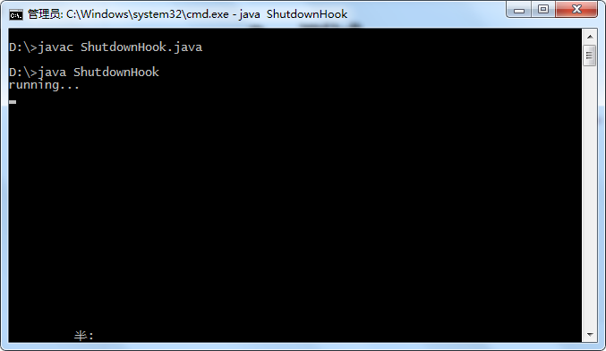
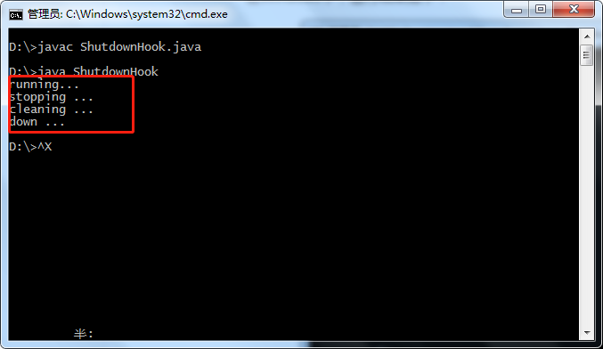
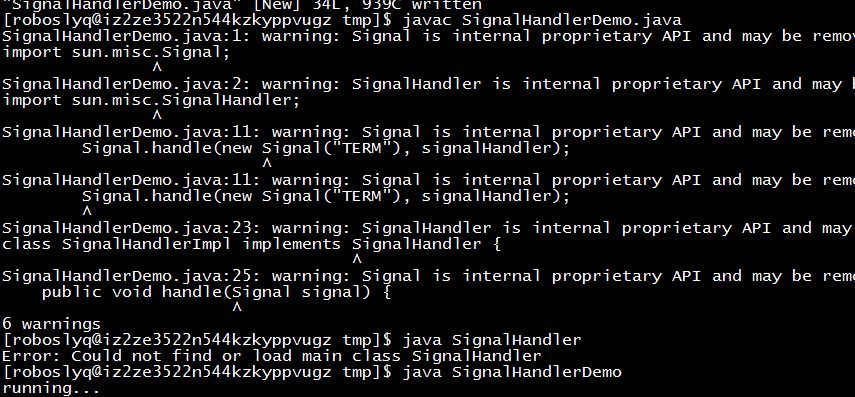
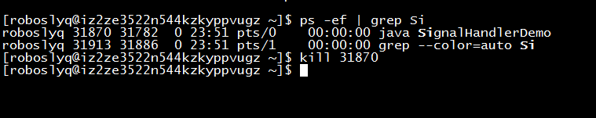
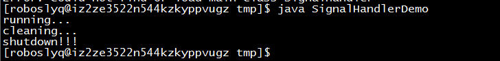

* content
{:toc}
# Java 优雅停机

何实现Java的优雅停机呢？在linux直接kill -9 实在是太暴力了，所以我们常用kill -15 或者kill。因为kill 默认参数是-15。这样关闭java进程会收到通知。JVM再收到通知后会调用一个钩子函数，这样我们就可以实现一个钩子，实现在进程关闭之前进行相关的清理操作，比如关闭数据库链接，注册清理等。

# 方案一、钩子函数

## 1、实现Hook函数

很简单，只要实现`Runnable`接口即可

```java
class DemoHook extends Thread{
    @Override
    public void run(){
        System.out.println("stopping ...");
        System.out.println("cleaning ...");
        System.out.println("down ...");
    }
}
```

## 2、注册钩子函数

很简单，一行代码即可

```java
 Runtime.getRuntime().addShutdownHook(new DemoHook());
```

## 3、Windows测试

```java
public static void main(String[] args) {    
    Runtime.getRuntime().addShutdownHook(new DemoHook());   
    System.out.println("running...");
    for (;;){        
        try {            
            TimeUnit.SECONDS.sleep(1);        
        } catch (InterruptedException e) { 
            e.printStackTrace();        
        }    
    }
}
```


在Windows下，运行结果如下：



然后按`ctrl + c`结束运行



# 方案二： 实现Signal

## 1、实现Signal

```java
class SignalHandlerImpl implements SignalHandler {
    @Override
    public void handle(Signal signal) {
        String signalName = signal.getName();
        int signalNumber = signal.getNumber();
        if (signalName.equals("TERM") && signalNumber == 15) {
            System.out.println("cleaning...");
            System.out.println("shutdown!!!");
            System.exit(0);
        }
    }
}
```

## 2、注册Signal

注册部分也很简单，只有一行代码

```java
    Signal.handle(new Signal("TERM"), new SignalHandlerImpl());
```
## 3、Linux测试


```java
import sun.misc.Signal;
import sun.misc.SignalHandler;

import java.util.concurrent.TimeUnit;

public class SignalHandlerDemo {
    public static void main(String[] args){

        Signal.handle(new Signal("TERM"), new SignalHandlerImpl());
        System.out.println("running... ");
        for (;;){
            try {
                TimeUnit.SECONDS.sleep(1);
            } catch (InterruptedException e) {
                e.printStackTrace();
            }
        }
    }
 }
```
编译运行



关闭进程



打印日志




# 参考资料

https://www.jianshu.com/p/22b7ffd22b1e