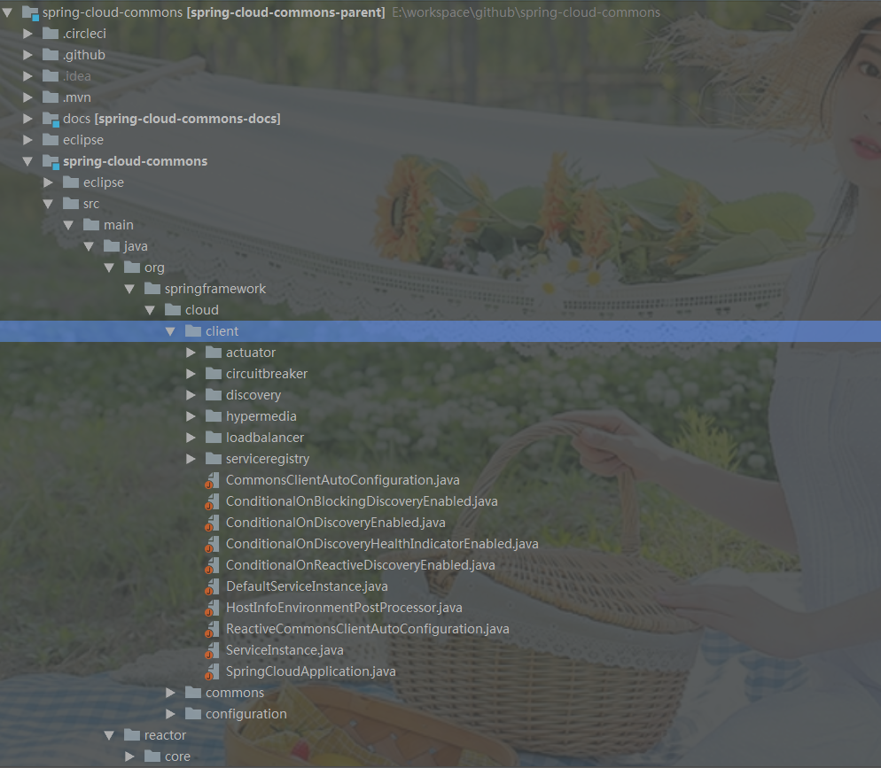

* content
{:toc}
# 源码阅读之SNAPSHOT版本环境搭建

> 以`spring-clou-commons`最新版'3.0.1-SNAPSHOT'为示例

## 下载SNAPSHOT版




刚下载的sanpshot版本使用IDEA打开后，存在两个问题：

- 项目不能正常的识别为maven项目，所有的java类都是普通文件
- parent项目`3.0.1-SNAPSHOT`找不到

> 项目不能正常的被识别为java项目的根据原因是parent找不到

## 解决parent依赖

### 小坑^_^(此处有小坑)

我本地的maven setting.xml已经存在如下配置了：

```xml
<mirrors>
    <mirror>
       <id>alimaven</id>
       <name>aliyun maven</name>
       <url>http://maven.aliyun.com/nexus/content/groups/public/</url>
       <mirrorOf>central</mirrorOf>
    </mirror>
    <mirror>
        <id>spring</id>
        <mirrorOf>*</mirrorOf>
        <name>Human Readable Name for this Mirror.</name>
        <url>http://repo.spring.io/release/</url>
    </mirror>
  </mirrors>
```

### 问题原因

因为SNAPSHOT类型的项目没有正式发布，所以正常情况下，中央仓库是没有这些包的。那么需要我们自已编译这些包或者从其它地方下载。如果是spring boot项目，可以配置如下仓库进行相关pom依赖下载：

```xml
<profiles>
   <profile>
      <id>spring</id>
      <repositories>
         <repository>
            <id>spring-snapshots</id>
            <name>Spring Snapshots</name>
            <url>https://repo.spring.io/snapshot</url>
            <snapshots>
               <enabled>true</enabled>
            </snapshots>
         </repository>
         <repository>
            <id>spring-milestones</id>
            <name>Spring Milestones</name>
            <url>https://repo.spring.io/libs-milestone-local</url>
            <snapshots>
               <enabled>false</enabled>
            </snapshots>
         </repository>
         <repository>
            <id>spring-releases</id>
            <name>Spring Releases</name>
            <url>https://repo.spring.io/release</url>
            <snapshots>
               <enabled>false</enabled>
            </snapshots>
         </repository>
      </repositories>
       <!--以下配置可选-->
      <pluginRepositories>
         <pluginRepository>
            <id>spring-snapshots</id>
            <name>Spring Snapshots</name>
            <url>https://repo.spring.io/snapshot</url>
            <snapshots>
               <enabled>true</enabled>
            </snapshots>
            <releases>
               <enabled>false</enabled>
            </releases>
         </pluginRepository>
         <pluginRepository>
            <id>spring-milestones</id>
            <name>Spring Milestones</name>
            <url>https://repo.spring.io/libs-milestone-local</url>
            <snapshots>
               <enabled>false</enabled>
            </snapshots>
         </pluginRepository>
         <pluginRepository>
            <id>spring-releases</id>
            <name>Spring Releases</name>
            <url>https://repo.spring.io/libs-release-local</url>
            <snapshots>
               <enabled>false</enabled>
            </snapshots>
         </pluginRepository>
      </pluginRepositories>
   </profile>
</profiles>
```

> 上面配置是spring 官方提供的配置，一般在SNAPSHOT项目中的pom中都存在此配置。

### 执行mvn 命令

> - mvnw install -P spring
>
> 或者
>
> - mvn install -P spring


上面中有三个比较关键信息http://repo.spring.io/release

- 项目中有一个mvnw文件，此命令可以直接执行

- 荐的pom.xml文件，已经自带spring 仓库相关配置

- 执行`mvnw install -P spring `报错

  - 现像是我明明要的是SNAPSHOT版本的依赖，怎么会跑去`http://repo.spring.io/release/org/springframework/cloud/spring-cloud-build/3.0.1-SNAPSHOT/maven-metadata.xml`下载呢？这是release的路径，我们禁用了SNAOSHOT版本，况且realease下一般没有SNAPSHOT版本。

    是什么原因呢？ 

    这就是上面说的那个小坑。我本地的maven有如下配置：

    ```xml
    <mirrors>
      <mirror>
           <id>alimaven</id>
           <name>aliyun maven</name>
           <url>http://maven.aliyun.com/nexus/content/groups/public/</url>
           <mirrorOf>central</mirrorOf>
        </mirror>
        <mirror>
            <id>spring</id>
            <mirrorOf>*</mirrorOf>
            <name>Human Readable Name for this Mirror.</name>
            <url>http://repo.spring.io/release/</url>
        </mirror>
    </mirrors>
    ```

    请注意：<id>spring</id>
            		<mirrorOf>*</mirrorOf>

    此处表所有的maven依赖都会进入`http://repo.spring.io/release`查找。因此才会出现上面的错误。注释掉此mirror配置后，再执行`mvnw install -P spring `命令：

  

各个依赖可以正常下载！！！


## 解决checkStyle问题

上面命令执行之后，不要以为就成功了，最终还是失败的：


原因是checkstyle校验不通过！！！

我们可以选择关闭checkstyle，命令如下：

>  mvn [target] -Dcheckstyle.skip

完整命令如下：

> mvnw install -Dmaven.test.skip=true -Dcheckstyle.skip=true -P spring

如果还不行，我们彻底解决问题，禁用checkstyle,不导入这个包！！

```xml
<build>
		<plugins>
			<plugin>
				<groupId>org.codehaus.mojo</groupId>
				<artifactId>flatten-maven-plugin</artifactId>
			</plugin>
			<plugin>
				<groupId>org.apache.maven.plugins</groupId>
				<artifactId>maven-eclipse-plugin</artifactId>
				<configuration>
					<useProjectReferences>false</useProjectReferences>
					<additionalConfig>
						<file>
							<name>.settings/org.eclipse.jdt.ui.prefs</name>
							<location>
								${maven.multiModuleProjectDirectory}/eclipse/org.eclipse.jdt.ui.prefs
							</location>
						</file>
						<file>
							<name>.settings/org.eclipse.jdt.core.prefs</name>
							<location>
								${maven.multiModuleProjectDirectory}/eclipse/org.eclipse.jdt.core.prefs
							</location>
						</file>
					</additionalConfig>
				</configuration>
			</plugin>
			<plugin>
				<groupId>io.spring.javaformat</groupId>
				<artifactId>spring-javaformat-maven-plugin</artifactId>
			</plugin>
			<!--<plugin>-->
				<!--<groupId>org.apache.maven.plugins</groupId>-->
				<!--<artifactId>maven-checkstyle-plugin</artifactId>-->
			<!--</plugin>-->
		</plugins>
	</build>

	<reporting>
		<!--<plugins>-->
			<!--<plugin>-->
				<!--<groupId>org.apache.maven.plugins</groupId>-->
				<!--<artifactId>maven-checkstyle-plugin</artifactId>-->
			<!--</plugin>-->
		<!--</plugins>-->
	</reporting>
```

> 注释上面的checkstyle plugins和plugin。再执行install命令：

