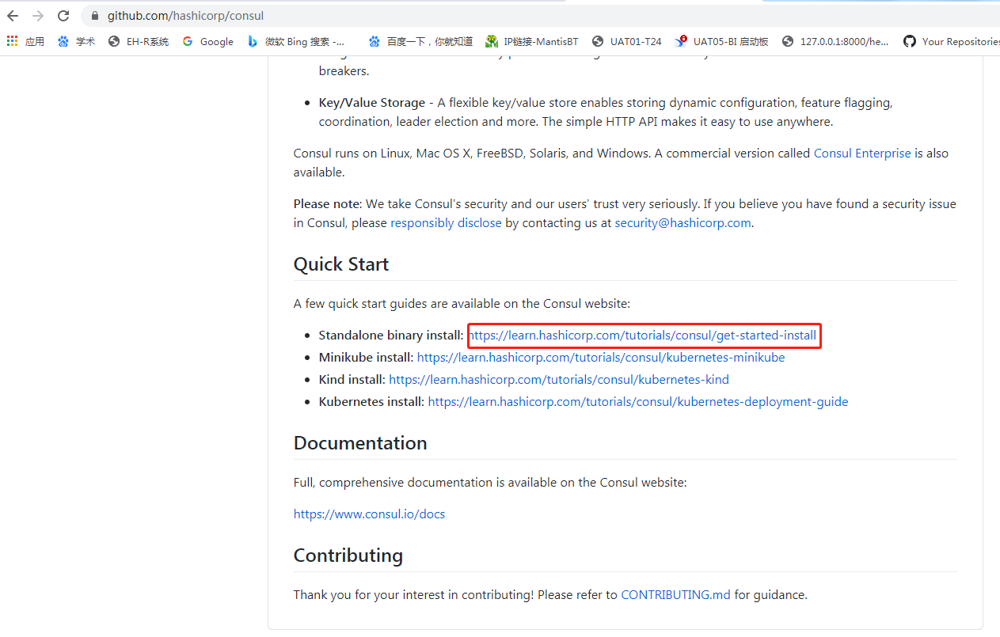
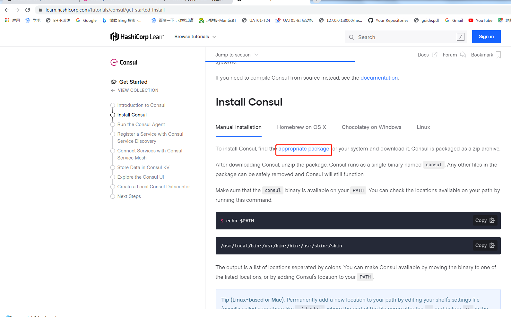
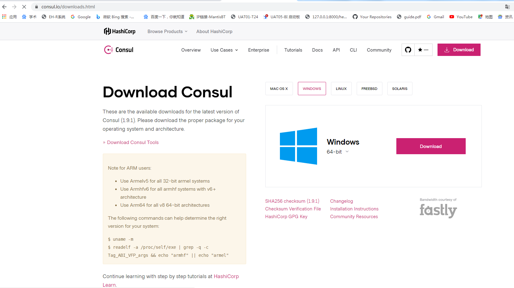
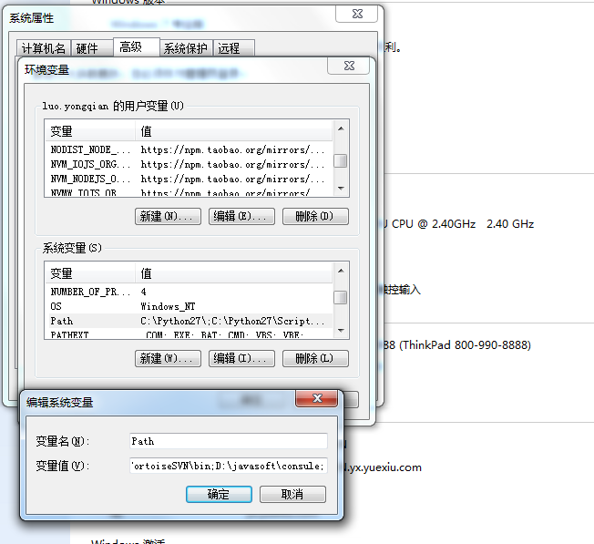
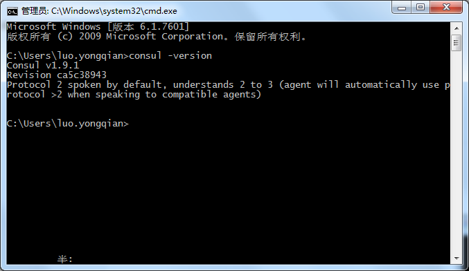
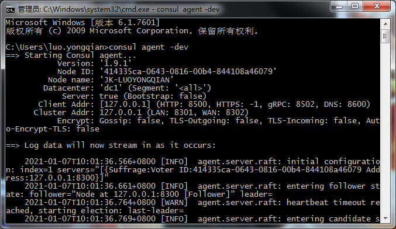
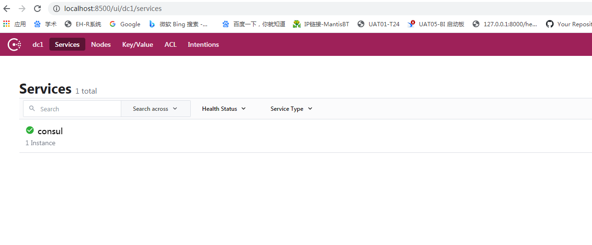

* content
{:toc}
# consul系列之环境搭建

## 1、相关网址

官方网址

> https://www.consul.io/

Github地址：

> https://github.com/hashicorp/consul

## 2、Consul安装

1、下载二进制安装包

## 3、二进制包单机安装

### 下载二进制

github中的readme.md下的Quick Start中，点击Standalone binary install

在上图中选择合适的版本进行下载，下载完成后解压，我们发现只有一个exe文件：

### 配置环境变量

### cmd窗口测试

使用命令`gradle -version`

### cmd窗口启动

cmd 命令窗口执行：`consul agent -dev`

> cmd 命令窗口执行:consul.exe agent -server ui -bootstrap -client 0.0.0.0 -data-dir="E:\consul" -bind X.X.X.X
>
> 其中X.X.X.X为服务器ip,即可使用http://X.X.X.X:8500 访问ui而不是只能使用localhost连接

### 启动结果验证

consul 自带 UI 界面，打开网址：[http://localhost:8500](https://link.zhihu.com/?target=http%3A//localhost%3A8500/) ，可以看到当前注册的服务界面

